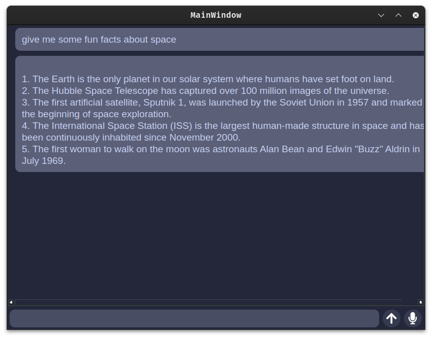

# school-project
voice assistant/chat bot (?) and my bash scripts which are in ./bash-scripts-scrappers/



## installation

```
git clone https://github.com/yumpyy/school-proj.git && pip install -r requirements.txt
```


## depedencies
1. [vosk](https://alphacephei.com/vosk/models) for voice transcribing
2. [piper](https://github.com/rhasspy/piper)
3. beautiful soup
4. [megumin voice model](https://huggingface.co/DogeLord/megumin/tree/main) for tts
5. [gpt4all model](https://gpt4all.io/models/models.json)

## todo
- [ ] install script
- [x] add gui
- [x] use gpt3.5 api for queries
    | couldnt get openai gpt api key, instead im using gpt4all orca mini model
- [ ] remove vosk-transcriber logs
